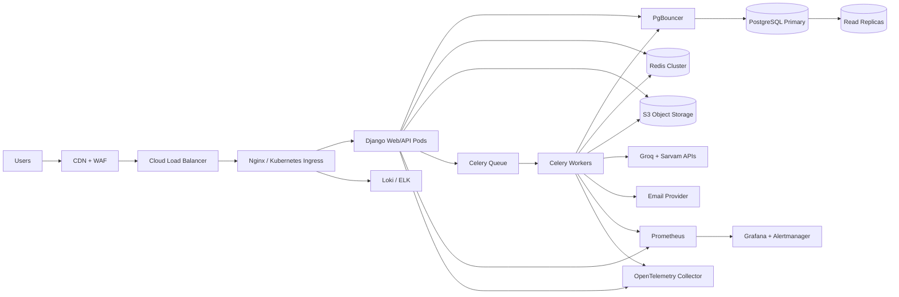
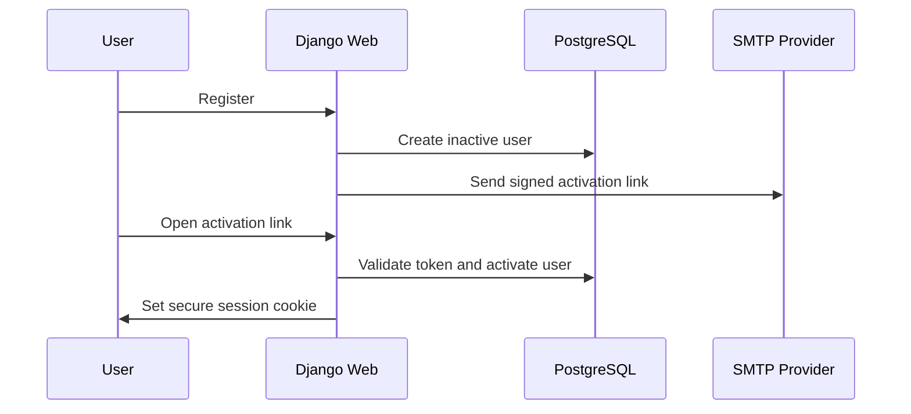
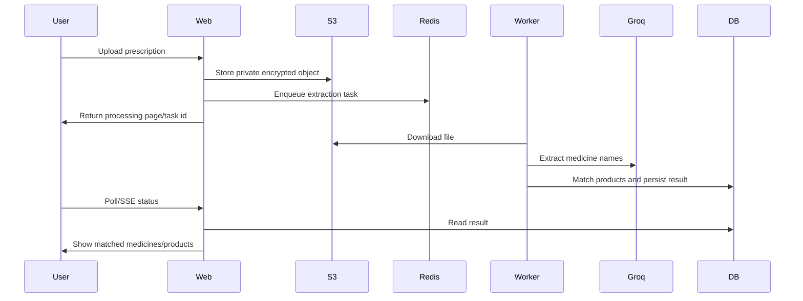
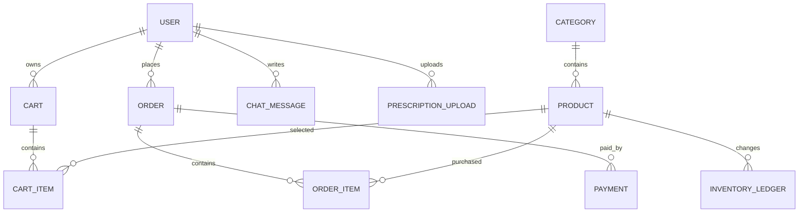

# PharmaCare Production System Design

## 1. Executive Summary

PharmaCare is a Django 5.2 online pharmacy and AI medical assistant application. The current product combines a medicine catalog, category browsing, prescription image analysis, cart and checkout, account registration with email activation, order history, and a multilingual AI assistant backed by Groq and Sarvam AI.

The current codebase is a strong monolithic MVP: Django templates serve the web UI, Django REST Framework exposes basic product/cart APIs, PostgreSQL is supported through `DATABASE_URL`, Redis is supported for product cache, and Gunicorn/WhiteNoise are already present for PaaS deployment. To operate like a production SaaS used by millions, PharmaCare should evolve into a modular monolith first, then split high-volume domains into services only when traffic proves the need.

Recommended target architecture:

- Django web/API service behind CDN, WAF, load balancer, and Nginx/Ingress.
- PostgreSQL primary database with read replicas, PITR backups, connection pooling, and well-defined indexes.
- Redis for cache, rate limits, sessions, Celery broker, idempotency locks, and short-lived AI results.
- Celery workers for AI extraction, TTS/STT, email, order workflows, cache warming, and scheduled jobs.
- S3-compatible object storage for product images, prescription uploads, audio files, and exports.
- Prometheus, Grafana, Loki, Sentry, OpenTelemetry, and alerting for production visibility.
- GitHub Actions building signed/scanned Docker images, deploying to staging first, then production by rolling update.

The immediate production risks are:

- `ALLOWED_HOSTS` was wildcarded and should be environment-scoped.
- Chatbot APIs are CSRF-exempt and need authenticated/session-safe API controls, rate limits, upload limits, and abuse protection.
- AI requests and transcription run synchronously in HTTP requests, which can exhaust Gunicorn workers.
- Uploaded media currently depends on local disk, which does not scale across containers.
- Cart uniqueness is enforced in view code instead of database constraints.
- Checkout has no transaction lock around stock/order creation.
- API viewsets expose broad CRUD without production permission classes.
- No durable queue, no object storage, limited test coverage, no CI/CD, and no container/Kubernetes manifests existed before this design pass.

## 2. Current Project Analysis

### Current Runtime

- Backend and frontend: Django server-rendered templates plus DRF endpoints.
- Apps: `products`, `cart`, `accounts`, `Chatbot`, legacy `app`.
- Database: SQLite by default, PostgreSQL via `DATABASE_URL`.
- Cache: Redis via `django-redis`, fallback local memory cache.
- AI: Groq chat/vision, Sarvam TTS/STT.
- Static files: WhiteNoise.
- Deployment hints: `build.sh`, Gunicorn, Render/Railway-style environment.

### Current Bottlenecks

- AI latency is on the request path for chatbot, prescription analysis, image OCR, TTS, and STT.
- Uploaded PDFs/images/audio are parsed in web workers, increasing memory and CPU pressure.
- Product search uses `icontains`, which will degrade as the product catalog grows.
- Cart total computation iterates item rows and product joins.
- Checkout performs order creation without `transaction.atomic`, inventory reservation, or idempotency.
- Product list caching helps, but search and category cache keys can grow unbounded without eviction policy.
- Local media storage breaks in horizontally scaled containers.

### Security Risks

- Chatbot endpoints use `csrf_exempt`.
- API viewsets need explicit authentication/authorization and method restrictions.
- User uploaded files need content-type validation, virus scanning, size limits, and private object storage.
- LLM prompts include user/order/cart context; this requires data minimization and audit controls.
- Error responses can expose provider failures and internal exception strings.
- Email activation depends on current domain; production must enforce trusted hosts.

### Single Points Of Failure

- Single database primary.
- Single Redis instance if deployed without managed HA.
- Single web container in MVP deployment.
- External AI providers as hard dependencies for AI features.
- SMTP relay dependency for registration and password reset flows.

### Improvement Priorities

1. Harden Django settings, host validation, secure cookies, CSRF, DRF permissions, and upload limits.
2. Move AI, email, file parsing, and order side effects to Celery.
3. Add PostgreSQL constraints/indexes and transaction-safe checkout.
4. Move media to S3 and serve public assets via CDN.
5. Add CI/CD, Docker, health checks, structured logs, metrics, tracing, and alerting.
6. Add idempotency, rate limiting, and fraud/abuse controls.

## 3. High-Level Architecture



### Request Flow

1. Browser hits `https://pharmacare.example.com`.
2. CDN terminates edge cache for static assets and blocks abusive traffic through WAF rules.
3. Load balancer routes to Nginx or Kubernetes Ingress.
4. Nginx forwards dynamic requests to Django/Gunicorn.
5. Django reads/writes PostgreSQL through PgBouncer and uses Redis for cache/session/rate limits.
6. Slow operations enqueue Celery jobs and return task/order state.
7. Workers process AI, email, prescription extraction, and order events asynchronously.
8. Logs, metrics, traces, and errors are exported centrally.

### Authentication Flow



For API-first/mobile clients, add OAuth2/OIDC or JWT with short access tokens, refresh token rotation, device binding, and revocation tracking. For the current template app, secure HttpOnly session cookies are safer than long-lived browser JWTs.

### AI Prescription Flow



## 4. Low-Level Design

### Recommended Database Model

Core existing tables:

- `auth_user`
- `products_category`
- `products_product`
- `cart_cart`
- `cart_cartitem`
- `products_order`
- `products_orderitem`
- `Chatbot_chatmessage`

Recommended production additions:

- `user_profile`: phone, addresses, consent flags, risk/audit metadata.
- `address`: normalized shipping/billing addresses.
- `prescription_upload`: user, object key, status, extracted text, detected medicines, error code.
- `inventory_ledger`: product, delta, reason, order, created_at.
- `payment`: provider, status, amount, currency, idempotency key, provider reference.
- `order_status_event`: immutable order status history.
- `audit_log`: actor, action, target, ip, user agent, metadata.
- `api_idempotency_key`: user/session, key, request hash, response pointer, expires_at.
- `notification`: email/SMS/WhatsApp send status and retry state.

### Table Relationships



### Indexing Strategy

Recommended indexes:

- `products_product(active, category_id, created_at DESC)` for listing.
- `products_product(slug)` unique, already present through slug uniqueness.
- PostgreSQL trigram GIN index on `lower(name)` and `lower(description)` for search.
- `cart_cart(user_id)` unique where `user_id IS NOT NULL`.
- `cart_cart(session_key)` where `session_key IS NOT NULL`.
- `cart_cartitem(cart_id, product_id)` unique.
- `products_order(user_id, created_at DESC)` for profile order history.
- `products_order(status, created_at DESC)` for operations dashboard.
- `Chatbot_chatmessage(user_id, created_at DESC)` and `(session_id, created_at DESC)`.
- `prescription_upload(user_id, created_at DESC)` and `(status, created_at)`.

### Caching Strategy

- Product home/list/detail cache: existing versioned cache is good for MVP.
- Product detail TTL: 10 minutes.
- Product list TTL: 5 minutes.
- Category list TTL: 30 minutes.
- User cart cache: short TTL, invalidated on cart mutation.
- Rate limit keys: Redis counters by user/IP/route.
- AI result cache: hash uploaded file bytes and reuse extraction for repeated uploads.
- CDN cache: static assets immutable, product images 7-30 days, dynamic pages no-store for authenticated users.

### API Structure

Target API namespace:

- `GET /api/v1/products/`
- `GET /api/v1/products/{slug}/`
- `GET /api/v1/categories/`
- `GET /api/v1/cart/`
- `POST /api/v1/cart/items/`
- `PATCH /api/v1/cart/items/{id}/`
- `POST /api/v1/orders/`
- `GET /api/v1/orders/`
- `POST /api/v1/prescriptions/`
- `GET /api/v1/prescriptions/{id}/`
- `POST /api/v1/chat/messages/`
- `POST /api/v1/audio/transcriptions/`
- `POST /api/v1/audio/speech/`

Use explicit serializer fields, permissions, pagination, throttling, and schema generation with OpenAPI.

### Service Boundaries

Start as a modular monolith:

- Catalog module: categories, products, search, cache invalidation.
- Cart module: cart state and pricing snapshot.
- Order module: checkout, payment, fulfillment lifecycle.
- Prescription module: upload, extraction, product matching.
- AI assistant module: chat, TTS, STT, safety policy, provider fallback.
- Notification module: email/SMS/WhatsApp.
- Identity module: users, sessions, OAuth, profiles.

Split into services only when independent scaling is necessary:

- Search service when product catalog/search load grows.
- AI workflow service when upload/chat latency dominates.
- Order/payment service when payment/fulfillment complexity grows.
- Notification service when outbound communication volume grows.

### Queue Architecture

Queues:

- `critical`: payment confirmation, order creation follow-up.
- `default`: email, cache warming, routine async work.
- `ai`: prescription extraction, chat summarization, TTS/STT.
- `bulk`: imports, product feed sync, report generation.
- `dead_letter`: failed jobs after max retries.

Retry policy:

- Network/provider failures: exponential backoff with jitter.
- Validation failures: do not retry.
- Rate limits: retry after provider reset.
- Payment/order tasks: idempotency key required.
- AI tasks: max 3 retries, then surface human-readable failure.

## 5. Production Docker Architecture

Generated files:

- `Dockerfile`
- `docker-compose.yml`
- `docker-compose.dev.yml`
- `docker-compose.prod.yml`
- `nginx/nginx.conf`
- `monitoring/prometheus.yml`
- `.env.example`
- `.dockerignore`

Container roles:

- `web`: Django + Gunicorn.
- `worker`: Celery worker for async jobs.
- `postgres`: local/dev database only; production should use managed PostgreSQL.
- `redis`: local/dev cache/broker only; production should use managed Redis.
- `nginx`: reverse proxy and TLS/static/media routing.
- `prometheus`, `grafana`, `loki`: local monitoring profile.

Production notes:

- Do not run production database as a lone Compose container for real users.
- Use managed PostgreSQL with backups, read replicas, and PgBouncer.
- Use managed Redis with HA.
- Use object storage instead of container volumes for media.
- Run migrations as a one-off job, not in every web replica, when using Kubernetes.

Local development:

```bash
cp .env.example .env
docker compose -f docker-compose.yml -f docker-compose.dev.yml up --build
```

Production-like Compose:

```bash
docker compose -f docker-compose.yml -f docker-compose.prod.yml up -d --build
```

Monitoring profile:

```bash
docker compose --profile monitoring up -d
```

## 6. Kubernetes Design

Generated file:

- `k8s/pharmacare.yaml`

The manifest includes:

- Namespace
- ConfigMap
- Secret placeholder
- Web Deployment
- Service
- Migration Job
- HorizontalPodAutoscaler
- TLS Ingress

Recommended production additions:

- ExternalSecrets backed by AWS Secrets Manager, GCP Secret Manager, or Vault.
- Cloud SQL/RDS instead of in-cluster PostgreSQL.
- Managed Redis instead of in-cluster Redis.
- Cert-manager ClusterIssuer.
- PodDisruptionBudget.
- NetworkPolicy isolating web, worker, database, and monitoring.
- Separate worker deployments per queue.
- Argo CD or Flux for GitOps.

## 7. Nginx And Reverse Proxy

Generated file:

- `nginx/nginx.conf`

Capabilities:

- HTTP to HTTPS redirect.
- TLS 1.2/1.3.
- Static file cache headers.
- Media routing.
- Gzip compression.
- Security headers.
- WebSocket upgrade support for future realtime features.
- Health endpoint proxy.

Production checklist:

- Replace `pharmacare.example.com` with real domains.
- Mount real certificates or use Kubernetes cert-manager.
- Put CDN/WAF in front of Nginx.
- Keep media private if prescriptions or medical documents are involved; prefer signed object URLs over public `/media/`.

## 8. Database Design

### Query Optimization

- Replace `icontains` product search with PostgreSQL trigram search or full-text search.
- Use `select_related` for product category and `prefetch_related` for order items.
- Add database-level unique constraints for cart and cart item integrity.
- Use `transaction.atomic()` for checkout.
- Lock product rows during checkout with `select_for_update()` to prevent overselling.
- Store order item price snapshots, already present, and never recompute historical prices from product rows.

### Partitioning

Partition when tables become large:

- `ChatMessage`: monthly by `created_at`.
- `Order`: monthly or quarterly by `created_at`.
- `AuditLog`: monthly by `created_at`.
- `PrescriptionUpload`: monthly by `created_at`.

### Replication

- Primary PostgreSQL for writes.
- One or more read replicas for product browsing, reporting, and admin dashboards.
- Use async replication for cost efficiency; use synchronous only for critical regulated workloads.

### Backup Strategy

- Daily full backups.
- Continuous WAL archiving/PITR.
- Quarterly restore drills.
- 30-90 day retention depending on compliance requirements.
- Separate encrypted backup account/project.

### Migration Strategy

- Expand/contract migrations for zero downtime.
- Add nullable columns first.
- Backfill asynchronously.
- Deploy code reading both old/new fields.
- Enforce NOT NULL/unique constraints after backfill.
- Run migrations as release jobs.

### Connection Pooling

- PgBouncer in transaction pooling mode.
- Gunicorn worker count should respect database max connections.
- Celery worker concurrency must be included in connection budgeting.

## 9. Security Architecture

### Django And Session Security

- Use environment-specific `ALLOWED_HOSTS`.
- Enforce HTTPS with `SECURE_SSL_REDIRECT`.
- Set `SESSION_COOKIE_SECURE`, `CSRF_COOKIE_SECURE`, `SESSION_COOKIE_HTTPONLY`, `CSRF_COOKIE_HTTPONLY`.
- Use SameSite=Lax for normal web sessions.
- Keep session auth for browser template flows.
- Use JWT/OAuth only for mobile/API clients.

### JWT/OAuth

If API clients are added:

- OAuth2/OIDC with Authorization Code + PKCE.
- Access token TTL: 5-15 minutes.
- Refresh token rotation.
- Store refresh token hashes server-side.
- Include token audience, issuer, expiry, and scope validation.
- Add device/session revocation.

### CSRF, XSS, SQL Injection

- Remove `csrf_exempt` from chatbot APIs or use CSRF tokens for same-origin browser calls.
- Use DRF authentication and throttling for API endpoints.
- Keep Django ORM parameterization.
- Add CSP headers with nonce support.
- Sanitize rendered LLM output; never mark AI text as safe HTML.

### Upload Security

- Max upload size at CDN/Nginx/Django.
- Validate file extension and MIME type.
- Scan files with antivirus before AI processing.
- Store medical uploads in private encrypted object storage.
- Generate short-lived signed URLs.
- Delete temporary local files reliably.

### Docker And Network Security

- Non-root container user.
- Drop Linux capabilities in Kubernetes.
- Read-only root filesystem where possible.
- No secrets baked into images.
- Separate edge and backend networks.
- Restrict database/Redis to backend network only.

### Zero Trust Principles

- Every service authenticates to dependencies.
- Network access is least privilege.
- Secrets are short-lived and rotated.
- Audit administrative actions.
- Centralize policy for PII/medical data access.

## 10. Observability And Monitoring

### Metrics

Use Prometheus metrics for:

- HTTP request count, latency, and error rate.
- Gunicorn worker count and restarts.
- DB query latency and connection pool saturation.
- Redis latency, evictions, and memory.
- Celery queue depth, task duration, retries, failures.
- AI provider latency, error rate, rate-limit events, token/audio usage.
- Order creation success/failure.
- Prescription extraction success/failure.

### Logging

Use structured JSON logs with:

- request_id
- user_id hash
- route
- status
- latency
- task_id
- provider
- error_code

Avoid logging:

- passwords
- tokens
- raw prescriptions
- full chat messages with sensitive health details
- SMTP credentials or API keys

### Tracing

Use OpenTelemetry:

- HTTP request spans.
- DB spans.
- Redis spans.
- Celery task spans.
- External AI provider spans.

### Alerting

Critical alerts:

- 5xx rate above 1-2% for 5 minutes.
- p95 latency above 1s for normal pages or 10s for AI endpoints.
- Celery queue age above threshold.
- Database CPU/storage/connection saturation.
- Redis memory eviction.
- Order creation failures.
- AI provider error spikes.
- Certificate expiry under 14 days.

## 11. CI/CD Pipeline

Generated file:

- `.github/workflows/ci-cd.yml`

Pipeline stages:

1. Checkout.
2. Python setup.
3. Dependency install.
4. Django deployment checks.
5. Unit tests.
6. Docker build.
7. Push image to GHCR.
8. Trivy vulnerability scan.
9. Deploy staging.
10. Promote production after environment approval.

Recommended additions:

- `ruff` or `flake8`.
- `black --check`.
- `mypy` for typed modules.
- `pip-audit`.
- Docker image signing with Cosign.
- SBOM generation.
- Playwright smoke tests for critical UI flows.
- Rollback automation using previous image digest.

## 12. Scalability Design

### Horizontal Scaling

- Keep web containers stateless.
- Store sessions in Redis or signed cookies.
- Store media in S3.
- Scale web pods on CPU, memory, request rate, and p95 latency.
- Scale workers on queue depth and task age.

### CDN

- Cache static files permanently with hashed filenames.
- Cache product images at edge.
- Cache anonymous product list pages carefully.
- Do not cache authenticated cart/order/profile pages.

### Database Scaling

- Add indexes first.
- Use PgBouncer.
- Add read replicas.
- Move analytics/reporting to replicas.
- Partition large append-only tables.
- Use sharding only after vertical scaling, indexing, replicas, and partitioning are exhausted.

### Redis Scaling

- Start with managed Redis HA.
- Use Redis Cluster when key volume and throughput require it.
- Separate cache Redis from broker Redis at scale.
- Use TTLs for all cache/rate-limit keys.

### Multi-Region

Phase 1:

- Single region, multi-AZ.

Phase 2:

- Active/passive disaster recovery region.
- Replicated object storage.
- Warm standby database.

Phase 3:

- Active/active reads by region.
- Region-local CDN and Redis.
- Global traffic manager.
- Carefully designed write ownership for orders/payments.

## 13. Cost Optimization

Cheapest credible production start:

- Render/Railway/Fly.io app container.
- Managed PostgreSQL.
- Managed Redis.
- Cloudflare CDN/WAF.
- S3-compatible storage such as Cloudflare R2, AWS S3, or Backblaze B2.
- GitHub Actions CI/CD.

Best growth architecture:

- AWS ECS Fargate or Kubernetes only after operational need is real.
- RDS PostgreSQL with read replica.
- ElastiCache Redis.
- S3 + CloudFront.
- SES for email.
- Managed Grafana/Prometheus or self-hosted on a small monitoring node.

Cost controls:

- Cache product pages and AI extraction results.
- Queue and batch expensive AI jobs.
- Use smaller/fallback AI models for simple requests.
- Compress uploaded images before vision calls where safe.
- Lifecycle old uploads to colder storage.
- Autoscale workers to zero or minimum during low traffic if platform supports it.

## 14. Failure Recovery And Reliability

### Retry Logic

- HTTP client timeouts everywhere.
- Exponential backoff with jitter.
- Retry only idempotent operations.
- Use provider-specific retry-after headers.

### Circuit Breakers

- Open circuit when Groq/Sarvam error rate spikes.
- Serve friendly fallback messages.
- Disable only affected AI feature, not the whole app.

### Dead Letter Queues

- Failed AI jobs go to `dead_letter`.
- Failed order/payment jobs require operator alert.
- Preserve request metadata and failure reason without sensitive payloads.

### Graceful Shutdown

- Gunicorn timeout and Kubernetes termination grace period aligned.
- Celery workers finish current task or requeue safely.
- Readiness probe fails before shutdown to drain traffic.

### Disaster Recovery

- RPO target: 15 minutes for PostgreSQL WAL/PITR.
- RTO target: 1-4 hours for early production.
- Monthly restore test.
- Runbook for database restore, DNS failover, and image rollback.

## 15. Engineering Best Practices

- Treat the current app as a modular monolith.
- Add tests around checkout, cart uniqueness, permissions, uploads, AI failure behavior, and cache invalidation.
- Use feature flags for risky rollout.
- Use idempotency keys for checkout and payment.
- Add OpenAPI docs for APIs.
- Keep provider integrations behind service classes.
- Add domain events: `OrderPlaced`, `PrescriptionUploaded`, `PrescriptionMatched`, `PaymentConfirmed`, `UserActivated`.
- Maintain runbooks for deployment, rollback, DB restore, queue drain, and incident response.

## 16. Future Improvements

- Replace legacy `app` models or remove the scaffold app.
- Add payment provider integration.
- Add prescription review workflow for pharmacists.
- Add inventory reservation and fulfillment.
- Add search service with PostgreSQL full-text first, OpenSearch later.
- Add WebSocket/SSE task progress for AI uploads.
- Add multi-language content moderation and medical safety guardrails.
- Add role-based access for admin/pharmacist/support.
- Add data retention policies for medical uploads and chats.
- Add compliance review for healthcare/medical data obligations in target countries.
